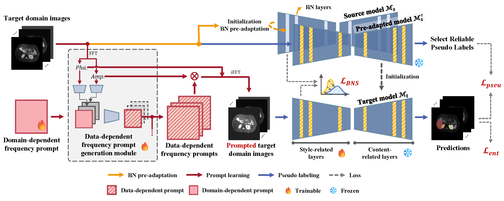

# SFDA-DDFP
## DDFP: Data-dependent Frequency Prompt for Source Free Domain Adaptation of Medical Image Segmentation

This is the official code for "DDFP: Data-dependent Frequency Prompt for Source Free Domain Adaptation of Medical Image Segmentation". <a href="https://arxiv.org/abs/2505.09927" title="SFDA-DDFP">Paper link</a>

## Paper 



Domain adaptation addresses the challenge of model performance degradation caused by domain gaps. In the typical setup for unsupervised domain adaptation, labeled data from a source domain and unlabeled data from a target domain are used to train a target model. However, access to labeled source domain data, particularly in medical datasets, can be restricted due to privacy policies. As a result, research has increasingly shifted to source-free domain adaptation (SFDA), which requires only a pretrained model from the source domain and unlabeled data from the target domain data for adaptation. Existing SFDA methods often rely on domain-specific image style translation and self-supervision techniques to bridge the domain gap and train the target domain model. However, the quality of domain-specific style-translated images and pseudo-labels produced by these methods still leaves room for improvement. Moreover, training the entire model during adaptation can be inefficient under limited supervision. In this paper, we propose a novel SFDA framework to address these challenges. Specifically, to effectively mitigate the impact of domain gap in the initial training phase, we introduce preadaptation to generate a preadapted model, which serves as an initialization of target model and allows for the generation of high-quality enhanced pseudo-labels without introducing extra parameters. Additionally, we propose a data-dependent frequency prompt to more effectively translate target domain images into a source-like style. To further enhance adaptation, we employ a style-related layer fine-tuning strategy, specifically designed for SFDA, to train the target model using the prompted target domain images and pseudo-labels. Extensive experiments on cross-modality abdominal and cardiac SFDA segmentation tasks demonstrate that our proposed method outperforms existing state-of-the-art methods.


## 0. Data prepocess
Preprocess the data using the correspounding file in ```preprocess/``` folder. Preprocessed data can be downloaded 
- MMWHS: Follow the instruction of <a href="https://github.com/cchen-cc/SIFA#readme" title="SIFA">SIFA</a>.
- Abdominal : Original site <a href="https://www.synapse.org/#!Synapse:syn3193805/wiki/217789" title="data">Synapse</a> . 
- Brate2018: Follow the instruction of <a href="https://github.com/icerain-alt/brats-unet.git" title="brats-unet">brats-unet</a>.

💡 Our preprocessed data can be downloaded from <a href="https://drive.google.com/drive/folders/1V8zDLW7A-BFz1FTLirut6U2o5ETVH1p_?usp=sharing" title="brats-unet">link</a>.


## 1. Source Model Training
Change parameters in ```configs/train_source_seg.yaml``` and ```configs/test_source_seg.yaml```

```
### Source Model Training
python main_trainer_source.py --config_file configs/train_source_seg.yaml --gpu_id 0

### Source Model Testing
python main_trainer_source.py --config_file configs/test_source_seg.yaml --gpu_id 0
```

## 2. BN Pre-adaptation
Change parameters in ```configs/train_target_adapt_bn.yaml.yaml```.

```
python target_adapte_trainer.py
```

## 3. Target Model Adaptation
Change parameters in ```configs/train_target_adapt_pmt.yaml``` and ```configs/test_target_adapt_pmt.yaml```.

```
## Target Model Training
python main_trainer_sfda.py --config_file configs/train_target_adapt_pmt.yaml --gpu_id 0 

## Target Model Testing
python main_trainer_sfda.py --config_file configs/test_target_adapt_pmt.yaml --gpu_id 0 
```

## Citation 
If you find the code useful for your research, please cite our paper.
```
@article{SFDA-DDFP,
title = {DDFP: Data-dependent frequency prompt for source free domain adaptation of medical image segmentation},
journal = {Knowledge-Based Systems},
volume = {324},
pages = {113651},
year = {2025},
issn = {0950-7051},
doi = {https://doi.org/10.1016/j.knosys.2025.113651},
url = {https://www.sciencedirect.com/science/article/pii/S0950705125006975},
author = {Siqi Yin and Shaolei Liu and Manning Wang},
}
```

## Acknowledgement
<a href="https://github.com/CSCYQJ/MICCAI23-ProtoContra-SFDA" title="Procontra">Procontra</a>